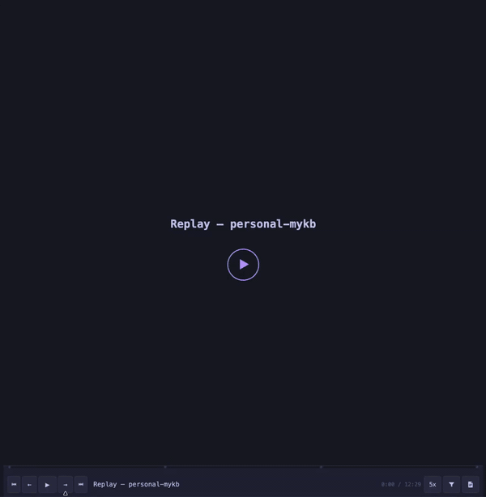
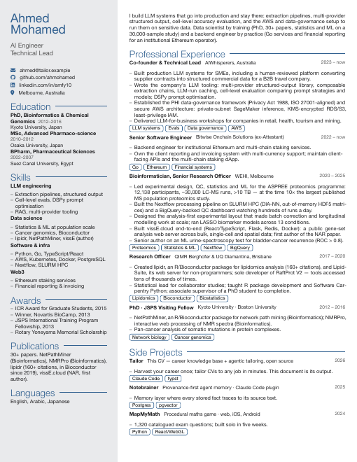
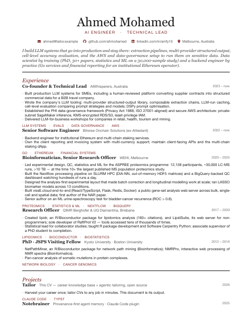
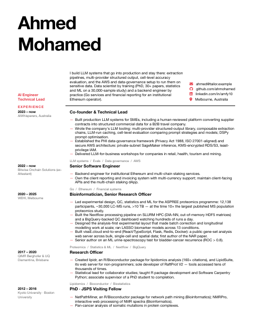
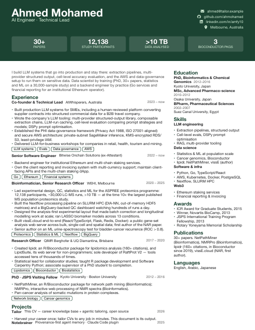
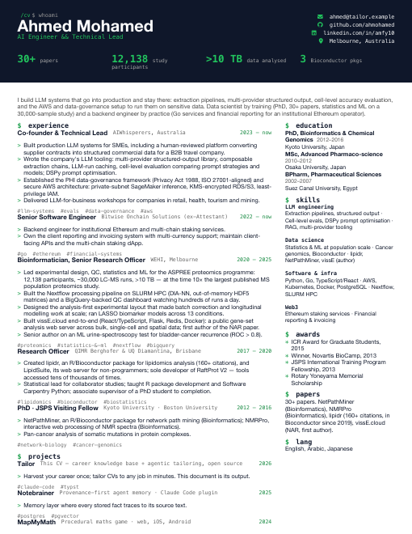
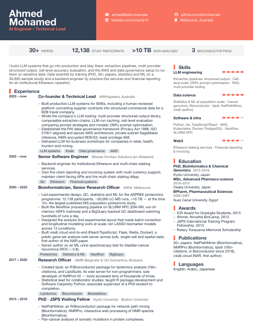

# Tailor

**Your career, harvested once. CVs tailored to any job in minutes, inside Claude Code.**

[](https://skills.sh/ahmohamed/tailor)

Tailor is a career knowledge base that lives in a git repo and is operated by [Claude Code](https://claude.com/claude-code). You harvest your career once — old CVs, GitHub, LinkedIn, publications, or just an interview — into canonical project records. From then on, every job ad, tender, or bio request is a five-minute tailoring pass over records you trust, not a rewrite from memory.

<p align="center"></p>

## How it works

```
sources/   raw harvest: your old CVs, GitHub recaps, LinkedIn export, notes
content/   the truth layer: one record per project (role, level, visibility, evidence)
briefs/    one folder per audience: job ad in → researched, selected, drafted CV out
templates/ 10 typst designs; /cvrender turns a draft into a designed PDF
```

`/tailor` runs seven phases per brief: research the audience → research the role → spec the document → gather every relevant record → rank and select (**you review the selection before a word is drafted**) → compress and draft with per-claim source traces → de-slop. It argues for you like a referee writing a reference letter — but it never invents a number, date, title, or employer, and every bullet traces back to a record.

## Quickstart

```sh
# use this repo as a template (keep your copy PRIVATE — it will hold your career data)
gh repo create my-kb --template ahmohamed/tailor --private --clone && cd my-kb
claude
```

Or install the skills into any agent via [skills.sh](https://skills.sh/ahmohamed/tailor) — `/setup` scaffolds the rest on first run:

```sh
npx skills add ahmohamed/tailor
```

Then, inside Claude Code:

1. `/setup` — environment check, facts interview, then guided harvest: drop old CVs in `sources/inbox/`, connect GitHub via `gh`, add a LinkedIn export, pull publications from OpenAlex — or just let it interview you. It writes the records, you resolve any conflicts it finds.
2. `/tailor "<paste a job ad>"` — researches the employer and the role, selects your strongest relevant records, stops for your review, then drafts.
3. `/cvrender` — picks a design and compiles a send-ready PDF.

## Requirements

- [Claude Code](https://claude.com/claude-code)
- For PDF rendering: `typst`, `poppler`, `pandoc`, Font Awesome 7
  (`brew install typst poppler pandoc && brew install --cask font-fontawesome`)
- Optional: `gh` CLI (GitHub harvest), a LinkedIn data export, an ORCID (publications)

## The designs

Ten typst CV designs ship in `templates/designs/` — sidebar, banner, editorial serif, timeline, swiss, cards, terminal, spine, dossier. Preview them all against the sample CV with `sh templates/preview.sh`.

| | | |
|---|---|---|
|  |  |  |
|  |  |  |

## Principles

- **Truth layer.** Records carry a role level (led / built / analysed / contributed) that rendering never promotes, and a visibility level (public / private / confidential) that rendering never violates — private client work is described functionally, never named.
- **Advocacy, not audit.** Emphasis, wording, and ordering are optimised in your favour; numbers, dates, titles, and employers only ever come from records or from you.
- **Your rulings stick.** Framing decisions you make once ("describe X as…", "never show project Y") live in `content/RULES.md` and apply to every future document.
- **Everything reviewable.** Selection stops for your approval; every draft block carries a source trace; a validator (`python3 check.py`) keeps the records consistent.

## Acknowledgements

- The de-slop pass ships [humanizer](https://github.com/blader/humanizer) (MIT) as a bundled skill.

## License

MIT
